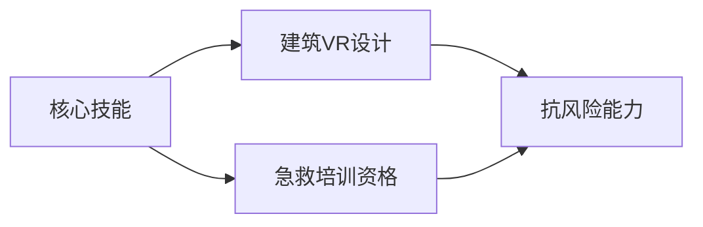

---

## 1. 商品销售数据分析报告

### 项目背景
    近年来，随着电商行业快速发展，消费者在购买商品时有了更多对比和选择，导致行业竞争日益激烈。某店家为了提升店铺商品的市场竞争力，利用 Python 对销售数据进行分析，为运营策略调整提供依据。

### 数据样本
| 序号 | 商品大类   | 子类 | 商品名称         | 商品编码 | 价格  |
|------|------------|------|------------------|----------|-------|
| 1    | 运动上装   | 背心 | 瑜伽背心         | bx001    | ¥48   |
| 2    | 运动上装   | 背心 | 跑步运动背心     | bx002    | ¥39   |
| 3    | 运动上装   | 背心 | 纯色简约背心     | bx003    | ¥36   |
| 4    | 运动上装   | 背心 | 轻薄透气背心     | bx004    | ¥49   |
| 5    | 运动上装   | 背心 | 修身运动背心     | bx005    | ¥50   |
| 6    | 运动上装   | 背心 | 美背裸露背心     | bx006    | ¥59   |
| 7    | 运动上装   | 短袖 | 网纱拼接美背短袖 | dx001    | ¥58   |
| 8    | 运动上装   | 短袖 | 透气跑步运动短袖 | dx002    | ¥55   |
| 9    | 运动上装   | 短袖 | 瑜伽修身短袖     | dx003    | ¥56   |
| 10   | 运动上装   | 短袖 | 圆领宽松短袖     | dx004    | ¥50   |
| 11   | 运动上装   | 长袖 | 半拉链立领长袖   | cx001    | ¥69   |
| 12   | 运动上装   | 长袖 | 修身瑜伽长袖     | cx002    | ¥79   |

### 分析方法
1. **按月份分析**销售金额变化趋势  
2. **商品维度分析**各品类销售占比  
3. **可视化工具**：Matplotlib/Seaborn 生成图表  

### 分析结论
- 运动上装类目贡献**主要销售额**  
- 各子品类（背心/短袖/长袖）月度占比**相对稳定**  
- 价格区间 ¥36-¥79，**长袖品类均价最高**  

---

## 2. 技术时代的个人定位与应对策略

### 一、核心定位：从「工具使用者」到「价值创造者」
| 能力类型         | 技术可替代领域                | 人类核心优势                  |
|------------------|-------------------------------|-------------------------------|
| **可自动化能力** | 重复性数据处理、基础编码      | **创造力**（突破框架解决方案）|
|                  | 标准化生产流程                | **共情力**（用户体验设计）    |
| **人性化能力**   | -                             | **复杂决策**（战略权衡）      |
|                  | -                             | **意义构建**（品牌故事）      |

**行动建议**：  
✅ 定期进行技能评估，优先投入「高人性化」领域  
✅ 成为「技术诠释者」而非被动使用者  

### 二、韧性成长系统构建


#### 关键策略：
1. **T型知识结构**  
   - 纵深：生物医药专家  
   - 横向：认知科学+算法伦理  
   - 工具推荐：`Obsidian` 构建知识图谱  

2. **人机协作流程**  
   ```python
   # 典型工作流示例
   AI生成初稿 → 人类优化情感层次  
   Midjourney原型 → 设计师完善细节
   ```

### 三、未来行动框架
| 周期       | 行动项                      | 交付物                  |
|------------|-----------------------------|-------------------------|
| 年度       | 技能审计（Gartner曲线）     | 技能分布热力图          |
| 季度       | 新技术工具测试              | 效率提升报告            |
| 月度       | 跨界对话（Z世代/银发族）    | 创新机会清单            |

> **未来洞察**：  
> 当机器在效率赛道领先时，人类应聚焦于  
> 🔹 情感的深度  
> 🔹 意义的创造  
> 🔹 道德困境的抉择  

--- 
